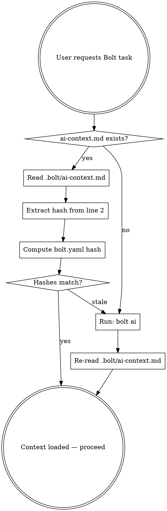

# Bolt — UE Workflow Automation

Bolt is a CLI tool for automating Unreal Engine workflows. Each project has its own `bolt.yaml` defining available commands. **You must never assume commands — always load the project-specific context first.**

## Context Loading (MANDATORY FIRST STEP)

Before executing ANY Bolt command, you must load the project's AI context. Follow this exact sequence:



### Step 1: Locate bolt.yaml

Bolt discovers `bolt.yaml` by walking up from the current working directory. If you know the project root, look there. Otherwise:

```bash
# Find bolt.yaml (Bolt searches upward from cwd automatically)
bolt check
```

If `bolt check` fails with "bolt.yaml not found", you are not in a Bolt-managed project.

### Step 2: Load or regenerate ai-context.md

Read `.bolt/ai-context.md` relative to the `bolt.yaml` location. If it does not exist, generate it:

```bash
bolt ai
```

### Step 3: Validate freshness

The second line of `ai-context.md` contains a hash:
```
<!-- bolt.yaml hash: 01139e81e95468a7 -->
```

Compute the current hash and compare:
```bash
sha256sum bolt.yaml | cut -c1-16
```

If the hashes differ, `bolt.yaml` has changed — regenerate:
```bash
bolt ai
```

Then re-read `.bolt/ai-context.md`.

### Step 4: Use the context

The loaded `ai-context.md` contains the **complete command reference** for this project:
- All ops and their variants (`bolt go <op>[:<variant>]`)
- All actions (`bolt run <action>`)
- Defined targets
- Pipeline order and fail-stop rules
- Available flags

**Use only commands listed in the context.** Do not guess or invent commands.

## Command Syntax

### Pipeline ops: `bolt go`

Run one or more ops in pipeline-sorted order:
```bash
bolt go update build start          # chain multiple ops
bolt go build:editor                # specific variant
bolt go build --config=debug        # with parameters
bolt go update build --dry-run      # preview without executing
```

### Named actions: `bolt run`

Run a standalone action workflow:
```bash
bolt run daily_check
bolt run build_editor --dry-run
bolt run build_editor --config=debug
```

### Flags

| Flag | Effect |
|------|--------|
| `--dry-run` | Preview steps without executing |
| `--key=value` | Pass parameter to ops/actions |

### Introspection (when ai-context.md is insufficient)

```bash
bolt list                    # all ops and actions
bolt inspect go <op>         # resolved steps for an op
bolt inspect run <action>    # resolved steps for an action
bolt info                    # project and VCS summary
```

## Safety Rules

1. **Always `--dry-run` first** for build, update, or any destructive operation. Show the user the plan before executing.
2. **Never run `bolt go kill` without confirmation** — it terminates all running UE processes.
3. **Respect fail_stops** — if the context says `build` is a fail-stop, do not chain ops after it unless the user explicitly asks.
4. **Do not modify bolt.yaml** unless the user explicitly asks. Configuration changes can break workflows.

## Common Patterns

**Build the editor:**
Check `ai-context.md` for the exact command — it varies per project. Typical patterns:
- `bolt go build:editor` (pipeline op with variant)
- `bolt run build_editor` (named action)

**Daily sync + build + launch:**
- `bolt go update build start` (pipeline — runs in configured order)
- `bolt run daily_check` (if defined as an action)

**Update only project repo (not engine):**
- `bolt go update:project`

**Build with a specific config:**
- `bolt go build:editor --config=debug`

## Errors

| Symptom | Cause | Fix |
|---------|-------|-----|
| "bolt.yaml not found" | Not in a Bolt project directory | `cd` to the project root |
| "Unknown op" | Op not defined in this project's bolt.yaml | Run `bolt list` to see available ops |
| "Unknown variant" | Variant not defined for this op | Run `bolt inspect go <op>` to see variants |
| Build fails mid-pipeline | Build error in UE | Check the log file path printed in output |
