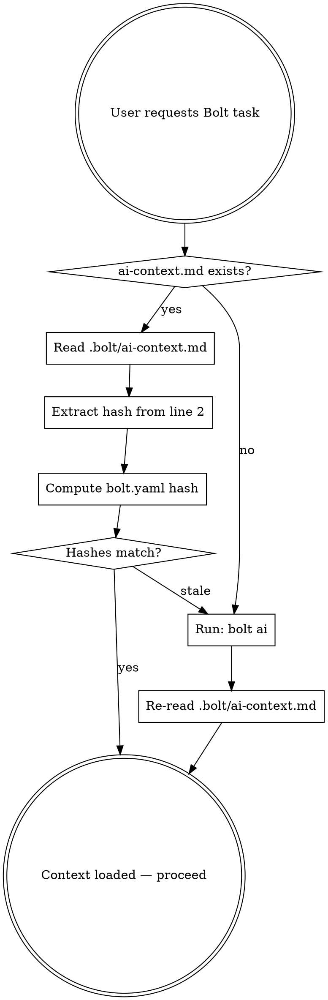

# Bolt — UE Workflow Automation

Bolt is a CLI tool for automating Unreal Engine workflows. Each project has its own `bolt.yaml` defining available commands. **You must never assume commands — always load the project-specific context first.**

## Context Loading (MANDATORY FIRST STEP)

Before executing ANY Bolt command, you must load the project's AI context. Follow this exact sequence:



### Step 1: Locate bolt.yaml

Bolt discovers `bolt.yaml` by walking up from the current working directory. If you know the project root, look there. Otherwise:

```bash
# Find bolt.yaml (Bolt searches upward from cwd automatically)
bolt check
```

If `bolt check` fails with "bolt.yaml not found", you are not in a Bolt-managed project.

### Step 2: Load or regenerate ai-context.md

Read `.bolt/ai-context.md` relative to the `bolt.yaml` location. If it does not exist, generate it:

```bash
bolt ai
```

### Step 3: Validate freshness

The second line of `ai-context.md` contains a hash:
```
<!-- bolt.yaml hash: 01139e81e95468a7 -->
```

Compute the current hash and compare:
```bash
sha256sum bolt.yaml | cut -c1-16
```

If the hashes differ, `bolt.yaml` has changed — regenerate:
```bash
bolt ai
```

Then re-read `.bolt/ai-context.md`.

### Step 4: Use the context

The loaded `ai-context.md` contains the **complete command reference** for this project:
- All tasks (`bolt run <task>`) and their steps
- All flows (`bolt run <flow>`) and their `continue_on_fail` policy
- Defined targets
- Available flags

**Use only commands listed in the context.** Do not guess or invent commands.

## Model

- A **task** is a named list of steps (the only building block).
- A **flow** is an ordered set of tasks. Fail-fast: the first failing task aborts
  the flow, unless it is listed in `continue_on_fail`.
- One verb, `bolt run`: pass task names to run them in the order you type, or a
  single flow name to run a predefined flow. What you type is what runs — there
  is no hidden reordering.

## Config split

- `bolt.yaml` — shared, committed contract (project identity, tasks, flows, targets). No machine paths.
- `bolt.local.yaml` — per-machine paths (engine/project/uproject), gitignored. `bolt init` scaffolds both.

## Command Syntax

### `bolt run`

```bash
bolt run update build start         # tasks: run in the typed order
bolt run daily                      # flow: run a predefined goal
bolt run build --target=client      # params (replace old variants)
bolt run build --config=debug       # build configuration param
bolt run update build --dry-run     # preview without executing
```

### Flags

| Flag | Effect |
|------|--------|
| `--dry-run` | Preview steps without executing |
| `--key=value` | Pass a parameter to the whole run (e.g. `--target=client`) |

### Introspection (when ai-context.md is insufficient)

```bash
bolt list                    # all tasks and flows
bolt inspect <name...>       # resolved steps for a task or flow
bolt info                    # project and VCS summary
```

## Safety Rules

1. **Always `--dry-run` first** for build, update, or any destructive operation. Show the user the plan before executing.
2. **Never run a `kill` task without confirmation** — it terminates all running UE processes.
3. **Respect fail-fast** — flows abort on the first failing task by default; do not work around an aborted flow (e.g. by re-running downstream tasks) unless the user explicitly asks.
4. **Do not modify bolt.yaml / bolt.local.yaml** unless the user explicitly asks. Configuration changes can break workflows.

## Common Patterns

**Build the editor:**
Check `ai-context.md` for the exact task name — it varies per project. Typical:
- `bolt run build` (task; may default to the editor target)
- `bolt run build --target=editor`

**Daily sync + build + launch:**
- `bolt run update build start` (tasks in typed order)
- `bolt run daily` (if a flow is defined)

**Build with a specific config or target:**
- `bolt run build --config=debug`
- `bolt run build --target=client`

## Errors

| Symptom | Cause | Fix |
|---------|-------|-----|
| "bolt.yaml not found" | Not in a Bolt project directory | `cd` to the project root |
| "bolt.local.yaml missing or invalid" | Per-machine config absent | Copy `bolt.local.example.yaml` → `bolt.local.yaml` (or run `bolt init`) and set paths |
| "Unknown task or flow" | Name not defined in this project's bolt.yaml | Run `bolt list` to see available tasks/flows |
| Build fails mid-flow | Build error in UE | Check the log file path printed in output |
